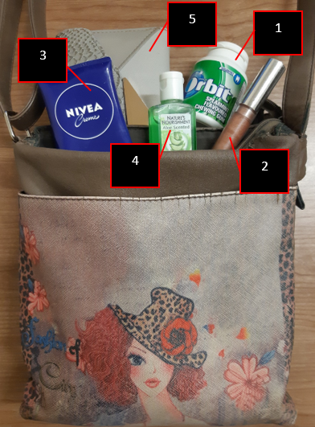

```{r dsetup, results = "hide", echo = FALSE, message = FALSE}
knitr::opts_chunk$set(
  echo = FALSE,
  fig.align = 'center',
  tidy = FALSE
)

library(knitr)
library(png)
```


## What is R and RStudio?

- R `->` both the programming language and the software that interprets the scripts
- RStudio `->` a front end (interface) to R, which makes using R a lot nicer


## Why learn R?

- R doesn't involve lots of pointing and clicking - easy to redo analysis if you collected more data
- R code is great for reproducibility - obtain same results from same dataset using same analysis
- R is extensible and interdisciplinary - ~14,000 packages to extend its capabilities, and statistical approaches from many scientific disciplines can be combined
- R works on data of all shapes and sizes - it is designed for data analysis
- R produces high-quality graphics - can adjust any aspect of your graph
- R has a large community - mailing lists and websites (Stack Overflow)
- R is open-source and cross-platform - Anyone can inspect the source code - less chance for mistakes


## Layout of RStudio {.flexbox .vcenter}


```{r echo=FALSE, out.width="80%"}

include_graphics("figures/Layout2.png")

```

Credit: Jessica Ward, PhD Student, Newcastle University


## Create a new project

- It is good practice to keep a set of related data, analyses and text in single folder called the "working directory"
- You can easily share it with others without worrying about whether or not underlying scripts will still work
- Only ever use relative paths and not absolute paths


## Absolute vs relative paths {.flexbox .vcenter}

```{r echo=FALSE, out.width="80%"}

include_graphics("figures/Absolute_vs_relative.png")

```


## Time for... {.flexbox .vcenter}


## Your working directory should look like this {.flexbox .vcenter .smaller}


* Working directory = where R looks for files that you ask it to load, and where it will put any files that you ask it to save

## Interacting with R {.smaller}

- We write code/instructions = commands
- The computer executes/runs those commands
- Two ways to interact with R:
    + Type in the console and press Enter to execute -> forgotten when closed
    + Type in script editor and press Ctrl + Enter -> save code and workflow
- Prompt > is displayed when R is ready to accept commands
- Receives commands (typing, copy-pasting or sent from script editor) -> execute -> show results -> new prompt
- If R waits for more data -> will show a + prompt (continuation symbol), which means you haven't finished entering a complete command
- Either enter the missing letter/value/symbol or click inside the console and press Esc


## Seeking help

- Where to ask for help:
    + Friendly colleagues
    + Stack Overflow: http://stackoverflow.com/questions/tagged/r
    + R-help mailing list: https://stat.ethz.ch/mailman/listinfo/r-help
        * Use correct vocabulary
        * Check for package-specific mailing lists
        * List of topic-specific mailing lists: http://www.r-project.org/mail.html

- Use built-in RStudio help interface (bottom-right panel)
- ?function()
- ??function()


## Time for... {.flexbox .vcenter}
   


## Structure of R expressions


- object = can be any word you like, but avoid dots (and no spaces!)
    + also watch out for existing function names
- `<-` = assignment operator
- function = name of the function followed directly by ()
    + Example: `x <- round(3.14159)`
- arguments = specified within the () of the function, separated by commas
    + Example: `x <- round(3.14159, digits = 2)`


## Time for... {.flexbox .vcenter}
   


## Data structures vs Data types

<div style="float: left; width: 50%;">

* Data structures:
    + Vector
    + Matrix
    + Array
    + Data Frame
    + List
    + Factor
  
</div>

<div style="float: right; width: 50%;">

* Data types:
    + Numeric
    + Integer
    + Complex
    + Logical
    + Character

</div>


## Data structures 


Credit: Maite Ceballos (IFCA) & Nicolas Cardiel (UCM)
http://venus.ifca.unican.es/Rintro/dataStruct.html


## Data structures

- Vector: one-dimensional array used to store collection data of the same mode.
- Matrix: two-dimensional array to store collections of data of the same mode.
- Array: similar to matrix, but can be multi-dimensional.
- Factor: vector of categorical variables designed to group the components.
- Data Frame: similar to matrices, but different columns can store different mode data.
- List: ordered collection of objects, where the elements can be of different types.
      

## Data types {.flexbox .vcenter}


Credit: Venkatesan Prabu .J (Wikitechy)
https://www.wikitechy.com/tutorials/r-programming/r-datatypes-vectors


## Time for... {.flexbox .vcenter}


## Importing data

- Sometimes there are a few lines of metadata at the top of the file: 
    + You can use `skip = n` to skip the first n lines. 
    + Or use `comment = "#"` to drop all lines that start with `#`.
- The data might not have column names:
    + You can use `col_names = FALSE` to tell `read_csv()` not to treat the first row as headings, and instead label them sequentially from X1 to Xn.
    + Alternatively you can pass `col_names` a character vector which will be used as the column names
- Specify the value (or values) that are used to represent missing values in your file:
    + `read_csv("data.csv", na = ".")`
  

## Time for... {.flexbox .vcenter}


## Factors {.flexbox .vcenter}

```{r echo=TRUE}

x <- factor(c("wallet", "gum", "lotion", "sanitizer", "lip-gloss"))
levels(x)
```

```{r echo=FALSE, out.width="80%"}



```


## Time for... {.flexbox .vcenter}


## Formatting dates {.flexbox .vcenter}


```{r echo=FALSE}

library(pander)

df <- data.frame(x = c("year month day",
                       "year day month",
                       "month day year",
                       "day month year",
                       "hour minute",
                       "hour minute second",
                       "year month day hour minute second"),
                 y = c("ymd()",
                       "ydm()",
                       "mdy()",
                       "dmy()",
                       "hm()",
                       "hms()",
                       "ymd_hms()"))


colnames(df) <- c("Order of date elements", "Parse function")

pander(df, type = "html")
```


## Time for... {.flexbox .vcenter}


## Data manipulation using dplyr and tidyr

* dplyr package makes tabular data manipulation easier
* tidyr package enables you to convert between different data formats for plotting and analysis
* New functions/analyses are developed and made available via packages
* Packages = additional functions that let you do more stuff
* Install package once - install.packages()
* Load pacakage with every R session when you need it
* tidyverse = umbrella package that installs several packages


## Time for... {.flexbox .vcenter}


## Pipes {.flexbox .vcenter}


## Time for... {.flexbox .vcenter}


## Split-apply-combine analysis {.flexbox .vcenter}


* It collapses each group into a single-row summary of that group

Credit: Ranae Dietzel & Andee Kaplan, https://agron590-isu.github.io/materials/week_08/dplyr/slides_dplyr.html


## Time for... {.flexbox .vcenter}


## Reshaping your data: spread {.flexbox .vcenter}

{width=70%}

<small>
Credit: Data Carpentry, https://datacarpentry.org/R-ecology-lesson/
</small>


## Time for... {.flexbox .vcenter}


## Reshaping your data: gather {.flexbox .vcenter}

{width=70%}

<small>
Credit: Data Carpentry, https://datacarpentry.org/R-ecology-lesson/
</small>

## Time for... {.flexbox .vcenter}


## Data visualization: building plots iteratively {.flexbox .vcenter}

`ggplot(data = <DATA>) + 
  <GEOM_FUNCTION>(mapping = aes(<MAPPINGS>))`

* `<DATA>` = your dataframe containing the data you want to plot  
* `<GEOM_FUNCTION>` = geometrical object that a plot uses to represent data, e.g. geom_line
* `<MAPPINGS>` = defines how variables in your dataset are mapped to visual properties [global mappings vs local mappings]


## Time for... {.flexbox .vcenter}


## Some other useful functions

```{r echo=TRUE, message=FALSE, warning=FALSE, eval=FALSE}

# Import data by browsing for file
my_data <- read.csv(file.choose(new = TRUE))

# Import Excel file (per sheet)
library(readxl)

read_excel("data/my_data.csv", sheet = "Sheet1")

```


## Some other useful functions

```{r echo=TRUE, message=FALSE, warning=FALSE, eval=FALSE}

# Update a package
tidyverse_update()

# Helper function to use within filter():
between(weight, 30, 50)

# Helper functions to use within select():
ends_with("xyz")
contains("cde")
select(df, col5, col6, everything())

# Create and keep only the new column:
transmute(df, new_column = old_column*2)

# Global substitutions (i.e. find and replace):
gsub(pattern, replacement, data)

```


## Some other useful functions

```{r echo=TRUE, message=FALSE, warning=FALSE, eval=FALSE}

# Remove an object from the environment
rm(object_name)

# Detach (i.e. "unload") a package
detach(tidyverse)

# Pick the top one (from arranged data)
dataframe %>%
  filter(!is.na(var1)) %>% 
  arrange(var1, var2, var3) %>% 
  slice(1)

dataframe %>%
  filter(!is.na(var1)) %>% 
  arrange(var1, var2, var3) %>% 
  top_n(1)

```


## Some other useful functions

```{r echo=TRUE, message=FALSE, warning=FALSE, eval=FALSE}

# Divide data into categories:
mutate(category = case_when(weight <= 100 ~ "small",
                            weight > 100 & weight < 200 ~ "medium",
                            weight > 200 ~ "large"))

# Rename specific column headers:
rename(df, new_name = old_name)

# Top 10 heaviest animals:
top_n(df, 10, weight)

# Separate (i.e. split) one column into multiple:
separate(column, into = c("col1", "col2"))

# Bind tables on columns or rows
cbind(df1, df2, ...)
rbind(df1, df2, ...)

```

## Some other useful functions {.smaller}

* Mutating joins: combine variables from two data.frames
  - inner_join(x, y, by = "key") keeps all observations present in both x and y.
  - left_join(x, y, by = "key") keeps all observations in x.
  - right_join(x, y, by = "key") keeps all observations in y.
  - full_join(x, y, by = "key") keeps all observations in x and y.
* Filtering joins: keep cases from the left-hand data.frame
  - semi_join(x, y) keeps all observations in x that have a match in y.
  - anti_join(x, y) drops all observations in x that have a match in y.
* Nesting joins: create a list column of data.frames
  - nest_join(x, y, by = "key") keeps all rows and all columns from x and adds a list column of tibbles
* Set operations: compare values of every variable
  - intersect(x, y): return only observations in both x and y.
  - union(x, y): return unique observations in x and y.
  - setdiff(x, y): return observations in x that are not in y.


## IF statements

```{r echo=TRUE, eval=FALSE}

if (condition) {
  # code executed when condition is TRUE
} else {
  # code executed when condition is FALSE
}


if (this) {
  # do this
} else if (that) {
  # do that
} else {
  # do something else
}

```


## IF statements

```{r echo=TRUE, eval=FALSE}

temp <- 15

if (temp <= 0) {
  "freezing"
} else if (temp <= 10) {
  "cold"
} else if (temp <= 20) {
  "cool"
} else if (temp <= 30) {
  "warm"
} else {
  "hot"
}

```


## Writing your own function

* Functions allow you to automate common tasks instead of copy-and-pasting
* Writing a function has 3 main advantages over using copy-and-paste:
  - You can give a function an evocative name that makes your code easier to understand.
  - As requirements change, you only need to update code in one place, instead of many.
- You eliminate the chance of making incidental mistakes when you copy and paste (i.e. updating a variable name in one place, but not in another).


## Writing your own function

```{r echo=TRUE, eval=FALSE}

function_name <- function(x) {
  y <- read.csv(x)
  
  y %>% 
    count(variable)
}

# Example

get_species <- function(x) {
  y <- read.csv(x)
  
  y %>% 
    count(species)
}

```


## Useful shortcuts

- Ctrl + Shift + N = New script
- Alt + "-" = Assignment operator `<-`
- Ctrl + Enter = Run selected command(s)
- Ctrl + Shift + S = Run the whole script
- Ctrl + Shift + R = Create script headers
- Alt + Shift + K = Keyboard shortcut quick reference
- F1 (when function is highlighted in pop-up tooltip) = activates help window
- Ctrl + Shift + M = Insert pipe character %>% 


## Summary

* RStudio projects give you a solid workflow that will serve you well in the future:
  - Create an RStudio project for each data analysis project.
  - Create a file structure that is logical and reusable - helps to automate future work.
  - Keep raw data files there.
  - Keep scripts there.
  - Save your outputs (plots and cleaned data) there.
  - Only ever use relative paths, not absolute paths.


## Summary

{width=60%,height=100%}